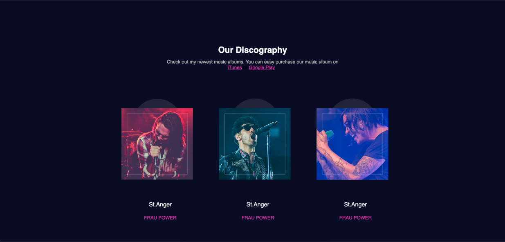

## Learning HTML & CSS 
This project is the first website I've built using HTML, CSS so that I can learn them.
It attempted to reproduce a website I've seen online called AiriBand.
I succeeded in creating gradients, adding transparency, used the right fonts with great fidelity.

And it looks really good.

This demonstrates my abilities in HTML and CSS.  

- Made in Febuary 2019